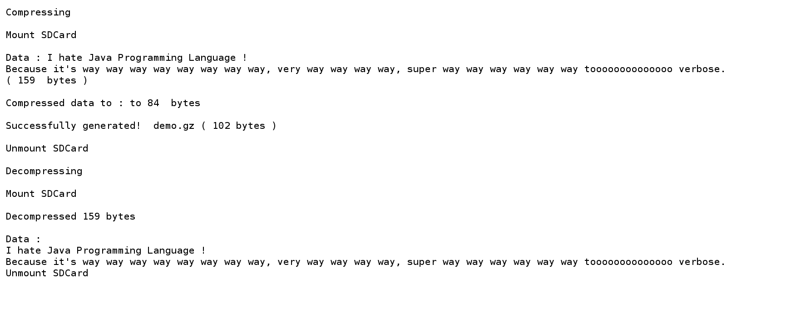

# Stm32-FatFs-Gzip

This project offers a simplified compressor that produces Gzip-compatible output with small resources for microcontrollers and edge computers. He uses the very basic LZ77 compression algorithm and static Deflate Huffman tree encoding to compress / decompress data into Gzip files.

He is based on a modified [uzlib](https://github.com/pfalcon/uzlib) library to create a minimalist [GNU GZIP Software](https://www.gnu.org/software/gzip/)  clone to compress data into Gzip files under the FatFs File System and microcontrollers.

## Compressor features

- Save energy and time when sending data.
- Data takes up less space, as a compression ratio can reach 50:1, but a ratio between 2:1 and 5:1 is common.
- Encapsulate data.
- Gzip file compatible with Multi-OS.

## In our case

This example is written for an Arm Cortex-M0 processor of the Stm32 family with the FatFs file system (to simplify playing with files on SDcard or eMMC, for more information , you can see [STM32-FatFs-FreeRtos](https://github.com/Bsm-B/Stm32-FatFs-FreeRTOS) ).

We compressed the data from 159 bytes to 84 bytes, and by adding additional information to build the structure of a [GZIP file](https://docs.fileformat.com/compression/gz/), we got 102 bytes.

## Reference

https://github.com/pfalcon/uzlib

https://www.rfc-editor.org/rfc/rfc1952

https://docs.fileformat.com/compression/gz

https://www.gnu.org/software/gzip

## License

Creative Commons Zero v1.0 Universal
